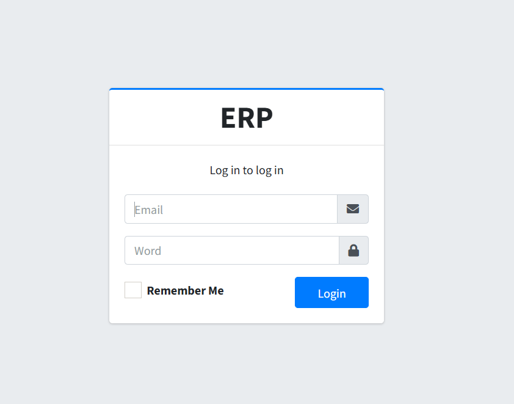
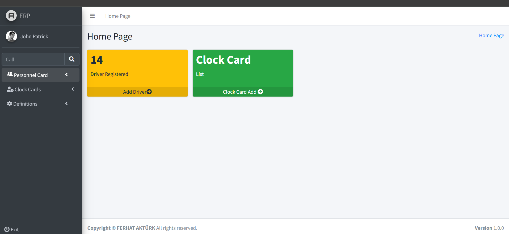
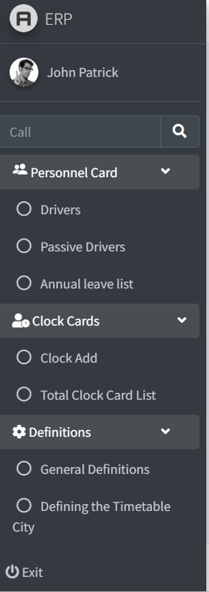
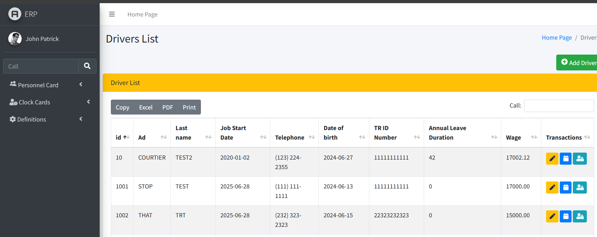
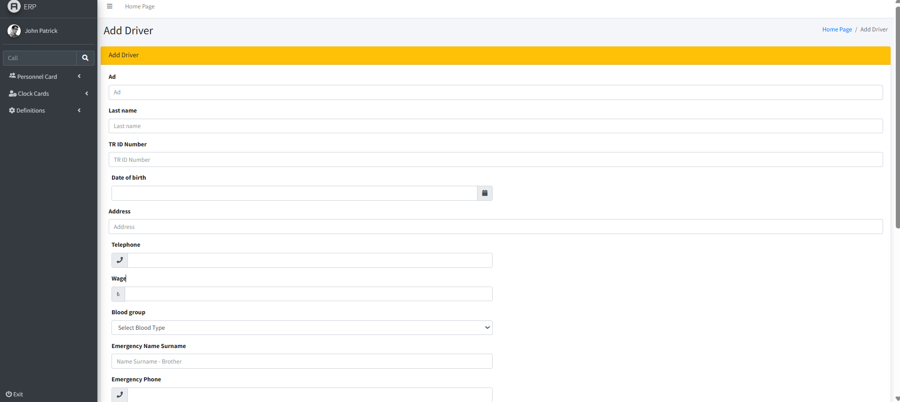
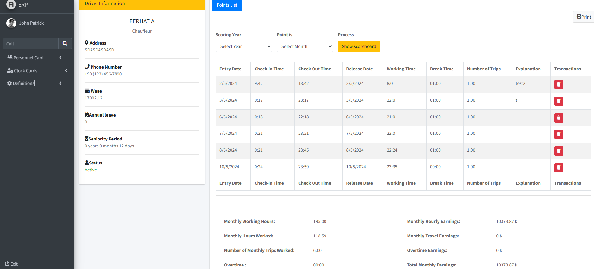
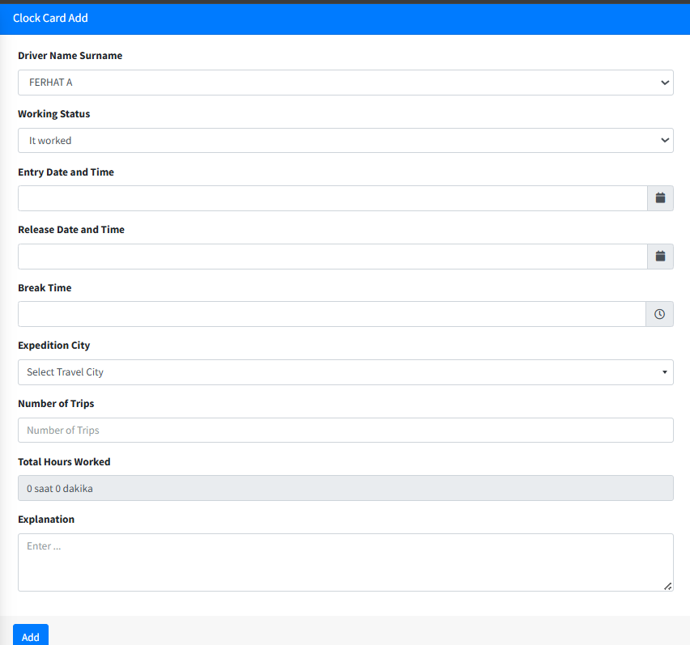
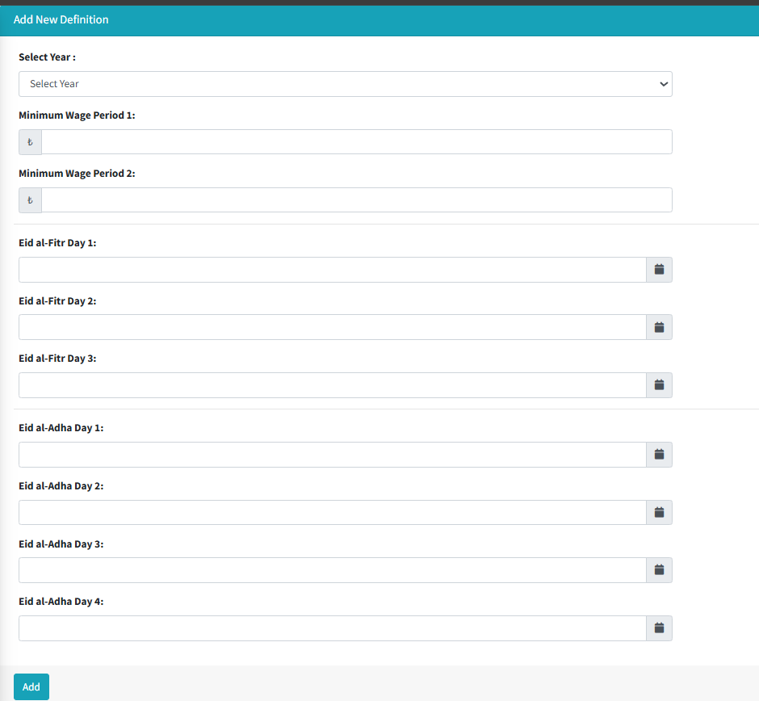
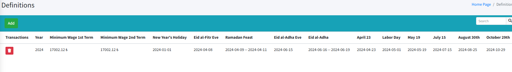

# Truck Driver ERP System

This project was developed in response to a set of challenges faced by a company employing truck drivers. The company had the following issues:

## Problem Statement

1. The company maintained a list of 50 truck drivers only by name and surname in an Excel sheet.
2. Drivers were paid based on their working hours, with different pay rates for overtime.
3. Working on holidays and weekends triggered different pay rates.
4. Monthly work schedules excluded Sundays and official holidays, and this was factored into salary calculations.
5. There was no system to manage or record annual leave requests.

All operations were previously managed through Excel spreadsheets, which became increasingly complex as the number of drivers grew. The company requested an online system that could be accessed at any time.

After consulting with the company, I proposed developing a web-based system.

## Technologies Used

- **Frontend Template:** AdminLTE (Bootstrap-based)
- **Backend Framework:** Laravel 8 (PHP)

## Features

### Login Page
- Users log in using their email and password.
- 

### Dashboard
- After successful login, users are directed to the homepage.
- The left sidebar contains navigation cards.
- Main screen includes quick actions to add truck drivers and manage clock cards.
- 

### Personnel Card
- Includes various submenu options.
- 
- Displays a list of truck drivers.
- 
- Allows editing driver details, managing working hours and wages, and deactivating drivers who have left.

### Add Driver
-  Form to add new drivers based on the company's input.
- 

### Clock Card
- Displays clock-in/out times, rest periods, and monthly earnings for a selected driver.
- 

### Work Hour Entry
- Allows entering a driver's working hours into the system.
- 

### Definitions
- Used to define annual minimum wage and list of public/religious holidays.
- 
- These definitions assist in calculating monthly salary and hourly rates.
- 

## Outcome

With this project:
- The company gained a centralized system to manage driver data, working hours, annual leave, and earnings.
- Faster data access was achieved through an advanced search functionality within the application.
- Operational efficiency increased, and Excel-based confusion was eliminated.

---

**Version:** 1.0.0  
**Developer:** Ferhat Aktürk
